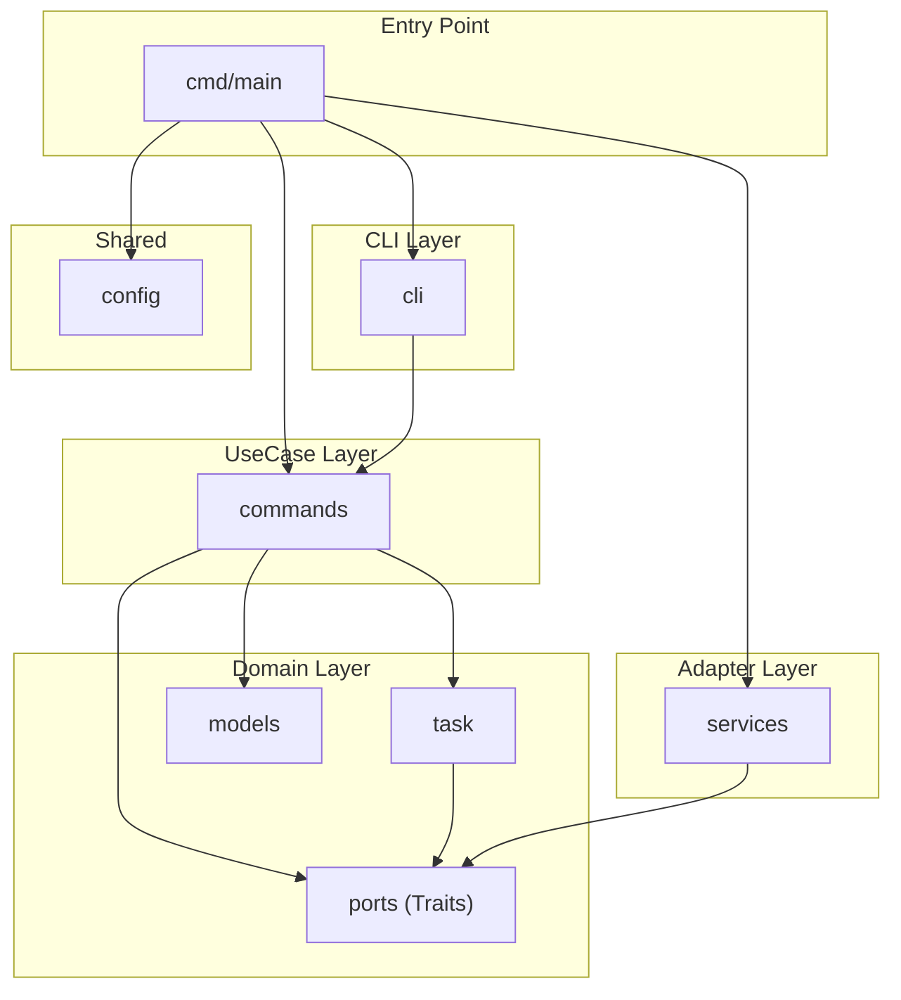
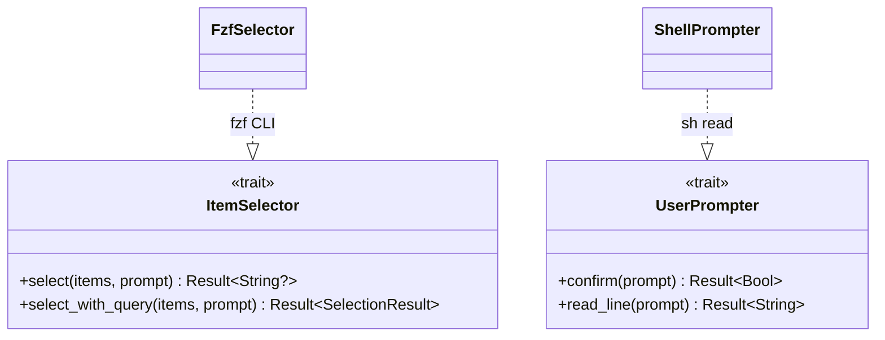
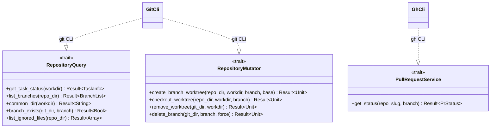
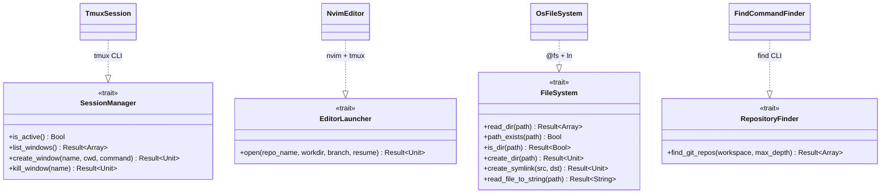
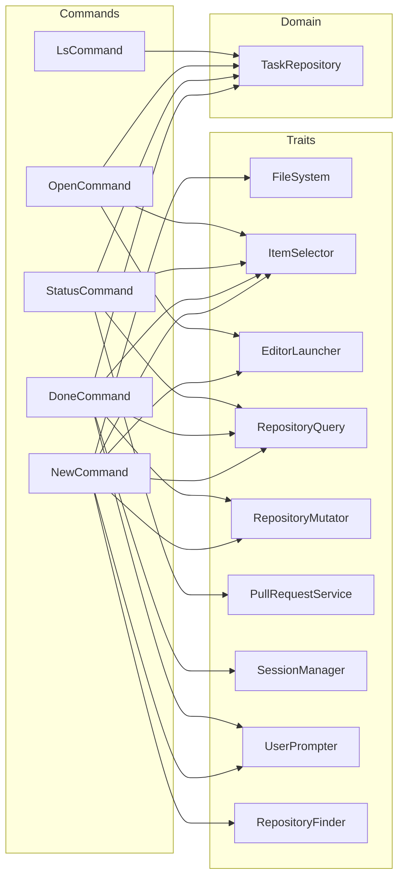
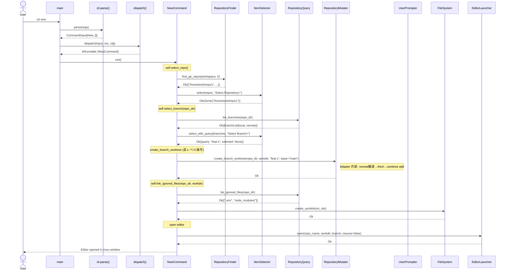
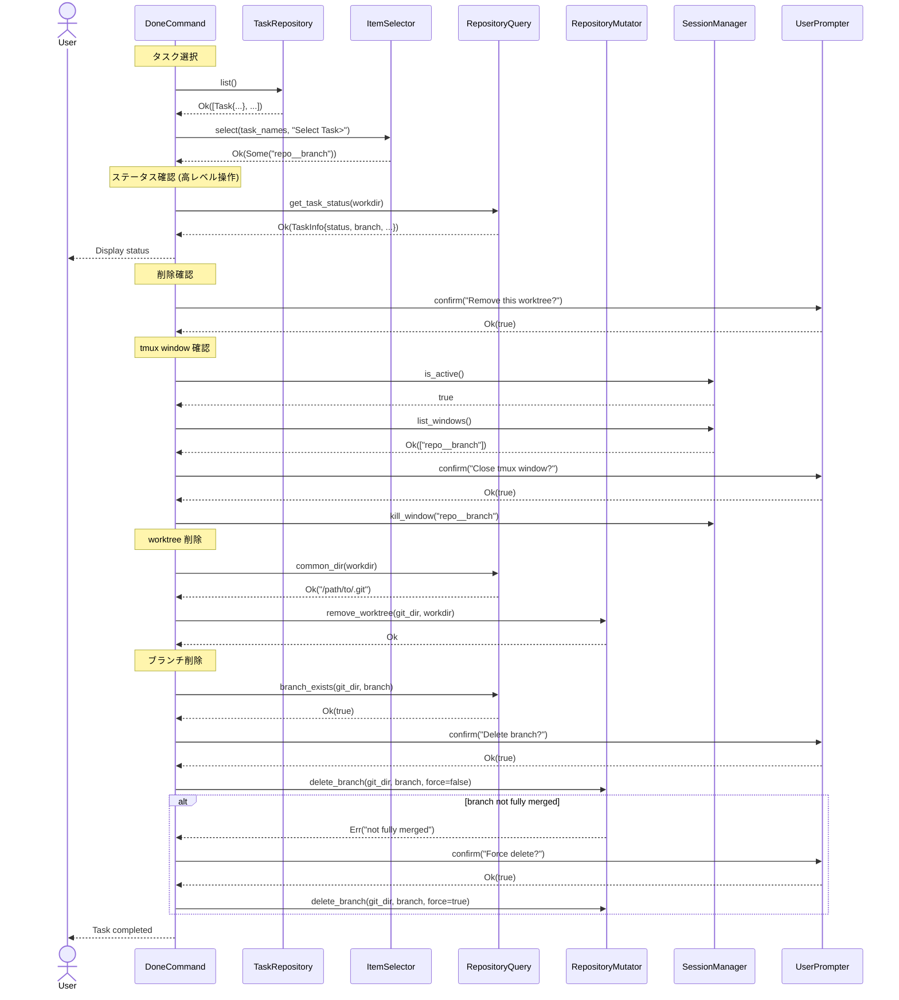

# Commands Layer Architecture

## 目的

commands 層（UseCase）が外部ツールの具体実装に直接依存している現状を解消し、
抽象化された trait を介して依存を逆転させる。これにより：

1. commands 層のユニットテストが可能になる（trait の mock 実装を注入）
2. 外部ツールの差し替えが容易になる（fzf → 別の selector 等）
3. 各層の責務が明確になる

## アーキテクチャ概要図

### パッケージ依存図



### Trait と Adapter の対応図

#### ユーザーインタラクション系



#### リポジトリ操作系



#### インフラ系



### コマンド別 依存図



### ctt new のシーケンス図



### ctt done のシーケンス図



## 設計原則

1. **依存方向:** `commands (UseCase) → ports (Trait) ← services (Adapter)`
2. **per-command DI:** 各コマンドは自分が必要な trait のみを保持する（god-object Context は使わない）
3. **sync/async 原則:** 外部プロセスを呼ぶ操作のみ `async`。ファイルシステム操作等は同期
4. **エラー処理:** Port 層の戻り値は `Result[T, String]` を使う。UseCase 側でパターンマッチにより明示的に扱う
5. **Config は引数で渡す:** `@config` への直接依存を排し、`workspace_dir` 等はコマンドの struct フィールドとして注入。`worktree_dir` は `workspace_dir` から導出する
6. **出力の検証:** `println` による出力は統合テストで検証する。trait 化はしない
7. **意図ベースの抽象化:** Port のメソッドは「何をしたいか」を表現する。低レベルな git 引数の組み立て等は Adapter に閉じ込める

## Trait 設計

### 配置: `src/ports/` パッケージ

trait 定義のみ。外部依存なし（`moon.pkg` の import は空）。
`pub(open)` でテストパッケージからの impl を許可する。

### 1. ItemSelector — ユーザーにリストから選択させる

```moonbit
pub(open) trait ItemSelector {
  async select(Self, items~ : Array[String], prompt~ : String) -> Result[String?, String]
  async select_with_query(Self, items~ : Array[String], prompt~ : String) -> Result[SelectionResult, String]
}

pub(all) struct SelectionResult {
  query : String
  selected : String?
}
```

**Adapter:** `FzfSelector`（fzf CLI）
**使用コマンド:** new, open, done, status

### 2. UserPrompter — ユーザーに確認・入力を求める

```moonbit
pub(open) trait UserPrompter {
  async confirm(Self, prompt~ : String) -> Result[Bool, String]
  async read_line(Self, prompt~ : String) -> Result[String, String]
}
```

**Adapter:** `ShellPrompter`（sh -c "read"）
**使用コマンド:** new, done

### 3. RepositoryQuery — リポジトリ状態の読み取り

命名は VCS 非依存。メソッドは UseCase が必要とする粒度で設計。
低レベルな個別クエリ (branch, uncommitted, commits_ahead) は `get_task_status` に集約。

```moonbit
pub(open) trait RepositoryQuery {
  async get_task_status(Self, workdir~ : String) -> Result[TaskInfo, String]
  async list_branches(Self, repo_dir~ : String) -> Result[BranchList, String]
  async common_dir(Self, workdir~ : String) -> Result[String, String]
  async branch_exists(Self, git_dir~ : String, branch~ : String) -> Result[Bool, String]
  async list_ignored_files(Self, repo_dir~ : String) -> Result[Array[String], String]
}

pub(all) struct BranchList {
  local : Array[String]
  remote : Array[String]
}
```

`get_task_status` は Adapter 内部で branch/uncommitted/commits_ahead/remote_url を取得し TaskInfo を構築する。
UseCase は TaskInfo を受け取るだけ。

**Adapter:** `GitCli`（git CLI）
**使用コマンド:** new, done, status

### 4. RepositoryMutator — リポジトリの変更操作

メソッドは「意図」を表現する高レベル操作。
`create_branch_worktree` は「ベースブランチから新しいブランチの worktree を作る」という一連の操作を抽象化。
Adapter 内部で remote 確認 → fetch → 適切な引数で `git worktree add` を行う。

```moonbit
pub(open) trait RepositoryMutator {
  async create_branch_worktree(Self, repo_dir~ : String, workdir~ : String, branch~ : String, base_branch~ : String?) -> Result[Unit, String]
  async checkout_worktree(Self, repo_dir~ : String, workdir~ : String, branch~ : String) -> Result[Unit, String]
  async remove_worktree(Self, git_dir~ : String, workdir~ : String) -> Result[Unit, String]
  async delete_branch(Self, git_dir~ : String, branch~ : String, force~ : Bool) -> Result[Unit, String]
}
```

`force_delete_branch` は廃止。`delete_branch(force=true)` で統一。

**Adapter:** `GitCli`（同一 struct が RepositoryQuery と RepositoryMutator 両方を impl）
**使用コマンド:** new, done

### 5. PullRequestService — PR 情報の取得

```moonbit
pub(all) struct PrStatus {
  state : String   // "OPEN", "MERGED", "CLOSED", ""
  url : String
}

pub(open) trait PullRequestService {
  async get_status(Self, repo_slug~ : String, branch~ : String) -> Result[PrStatus, String]
}
```

**Adapter:** `GhCli`（gh CLI）
**使用コマンド:** status（RepositoryQuery.get_task_status の Adapter 内部でも使用）

### 6. SessionManager — ターミナルセッション管理

```moonbit
pub(open) trait SessionManager {
  is_active(Self) -> Bool  // 環境変数チェックのみ。シェル出力不要
  async list_windows(Self) -> Result[Array[String], String]
  async create_window(Self, name~ : String, cwd~ : String, command~ : String) -> Result[Unit, String]
  async kill_window(Self, name~ : String) -> Result[Unit, String]
}
```

**Adapter:** `TmuxSession`（tmux CLI）
**使用コマンド:** done, (editor 内部)

### 7. EditorLauncher — エディタ起動

```moonbit
pub(open) trait EditorLauncher {
  async open(Self, repo_name~ : String, workdir~ : String, branch~ : String, resume~ : Bool) -> Result[Unit, String]
}
```

`resume` はエディタ側のセッション再開を意味する（tmux 固有ではない）。

**Adapter:** `NvimEditor`（nvim + optional tmux）
**使用コマンド:** new, open

### 8. FileSystem — ファイルシステム操作（同期のみ）

```moonbit
pub(open) trait FileSystem {
  read_dir(Self, path~ : String) -> Result[Array[String], String]
  path_exists(Self, path~ : String) -> Bool
  is_dir(Self, path~ : String) -> Result[Bool, String]
  create_dir(Self, path~ : String) -> Result[Unit, String]
  create_symlink(Self, src~ : String, dst~ : String) -> Result[Unit, String]
  read_file_to_string(Self, path~ : String) -> Result[String, String]
}
```

すべて同期メソッド。mock が容易。

**Adapter:** `OsFileSystem`（@fs + ln -s）
**使用コマンド:** new, (task 経由で) ls, open, done, status

### 9. RepositoryFinder — ワークスペースからリポジトリを探索（async）

```moonbit
pub(open) trait RepositoryFinder {
  async find_git_repos(Self, workspace~ : String, max_depth~ : Int) -> Result[Array[String], String]
}
```

FileSystem とは分離。外部プロセス (`find`) を使うため async。
mock テスト時に FileSystem と独立してスタブできる。

**Adapter:** `FindCommandFinder`（find CLI）
**使用コマンド:** new

## Task モジュール — タスクのライフサイクル管理

### 配置: `src/task/` パッケージ

タスク（= worktree）の一覧取得・検索等を集約する専用モジュール。
`list_tasks` / `require_tasks` はここに移動する。

```moonbit
pub(all) struct Task {
  name : String        // "repo__branch"
  repo_name : String   // "repo"
  branch : String      // "branch"
  workdir : String     // "/home/work/worktrees/repo__branch"
}

pub(open) trait TaskRepository {
  list(Self) -> Result[Array[Task], String]
  find(Self, name~ : String) -> Result[Task?, String]
}
```

**Adapter:** `OsTaskRepository` — `FileSystem` trait + `worktree_dir`（`workspace_dir` から導出）を使って実装:

```moonbit
pub(all) struct OsTaskRepository {
  fs : &FileSystem
  workspace_dir : String
}

fn worktree_dir(workspace_dir : String) -> String {
  workspace_dir + "/worktrees"
}

impl TaskRepository for OsTaskRepository with list(self) {
  let dir = worktree_dir(self.workspace_dir)
  let entries = match self.fs.read_dir(path=dir) {
    Ok(e) => e
    Err(e) => return Err(e)
  }
  // filter directories, parse "repo__branch" into Task structs
  ...
}
```

## 各コマンドの依存

### Per-command DI — 各コマンドが必要な trait のみ保持

| Command | 依存 |
|---------|------|
| `LsCommand` | `TaskRepository` |
| `OpenCommand` | `ItemSelector`, `EditorLauncher`, `TaskRepository` |
| `StatusCommand` | `ItemSelector`, `RepositoryQuery`, `PullRequestService`, `TaskRepository` |
| `DoneCommand` | `ItemSelector`, `UserPrompter`, `RepositoryQuery`, `RepositoryMutator`, `SessionManager`, `TaskRepository` |
| `NewCommand` | `ItemSelector`, `UserPrompter`, `RepositoryQuery`, `RepositoryMutator`, `EditorLauncher`, `FileSystem`, `RepositoryFinder` |

### コマンド struct 定義例

```moonbit
pub(all) struct LsCommand {
  tasks : &TaskRepository
}

pub(all) struct StatusCommand {
  selector : &ItemSelector
  repo : &RepositoryQuery
  pr : &PullRequestService
  tasks : &TaskRepository
  params : Array[String]
}

pub(all) struct NewCommand {
  selector : &ItemSelector
  prompter : &UserPrompter
  repo_query : &RepositoryQuery
  repo_mutator : &RepositoryMutator
  editor : &EditorLauncher
  fs : &FileSystem
  repo_finder : &RepositoryFinder
  workspace_dir : String
  config_dir : String
}
```

`worktree_dir` は `workspace_dir` から導出。struct フィールドとして持たない。

各コマンドのヘルパーメソッドは自身の struct メソッドとして定義:

```moonbit
impl NewCommand {
  async fn select_repo(self) -> Result[String, String] {
    let repos = match self.repo_finder.find_git_repos(workspace=self.workspace_dir, max_depth=5) {
      Ok(r) => r
      Err(e) => return Err(e)
    }
    match self.selector.select(items=repos, prompt="Select Repository> ") {
      Ok(Some(repo)) => Ok(repo)
      Ok(None) => Err("cancelled")
      Err(e) => Err(e)
    }
  }

  async fn select_branch(self, repo_dir : String) -> Result[(String, Bool), String] {
    let branches = match self.repo_query.list_branches(repo_dir=repo_dir) {
      Ok(b) => b
      Err(e) => return Err(e)
    }
    // ... fzf_select_with_query で選択
  }
}
```

## dispatch のリファクタリング

dispatch の引数を `Services`（Adapter 群）と `AppConfig`（設定値）にグルーピングする。
これらは DI コンテナではなく、main での組み立てを簡潔にするためのデータバンドル。
各コマンドの struct は必要な trait のみを取り出して保持する（per-command DI は維持）。

Services と AppConfig は組み立て時の関心事であり、ports（ドメイン抽象）に置かない。
`cmd/main/` に配置する。

```moonbit
// cmd/main/services.mbt
pub(all) struct Services {
  selector : &ItemSelector
  prompter : &UserPrompter
  repo_query : &RepositoryQuery
  repo_mutator : &RepositoryMutator
  pr : &PullRequestService
  session : &SessionManager
  editor : &EditorLauncher
  fs : &FileSystem
  repo_finder : &RepositoryFinder
  tasks : &TaskRepository
}

// cmd/main/app_config.mbt
pub(all) struct AppConfig {
  workspace_dir : String
  config_dir : String
}
```

`worktree_dir` は `AppConfig` に持たない。`workspace_dir + "/worktrees"` で導出する。

```moonbit
pub fn dispatch(input : CommandInput, svc : Services, cfg : AppConfig) -> &Runnable {
  match input.command {
    Ls => (LsCommand::{ tasks: svc.tasks } : &Runnable)
    Status => (StatusCommand::{
      selector: svc.selector, repo: svc.repo_query, pr: svc.pr,
      tasks: svc.tasks, params: input.params,
    } : &Runnable)
    New => (NewCommand::{
      selector: svc.selector, prompter: svc.prompter,
      repo_query: svc.repo_query, repo_mutator: svc.repo_mutator,
      editor: svc.editor, fs: svc.fs, repo_finder: svc.repo_finder,
      workspace_dir: cfg.workspace_dir, config_dir: cfg.config_dir,
    } : &Runnable)
    ...
  }
}
```

main 側:
```moonbit
let cfg = AppConfig::{ workspace_dir: @config.workspace_dir(), config_dir: @config.config_dir() }
let task_repo = OsTaskRepository::{ fs: os_fs, workspace_dir: cfg.workspace_dir }
let svc = Services::{ selector: FzfSelector::{}, ..., tasks: task_repo }
let command = @commands.dispatch(input, svc, cfg)
command.run()
```

## 各コマンドの Before → After

### cmd_new: select_repo（NewCommand のメソッドとして定義）

**Before:**
```moonbit
async fn select_repo() -> String {
  let (find_status, find_output) = @process.collect_output_merged("find", [workspace, ...])
  let selected = @services.fzf_select(repos, prompt="Select Repository> ")
}
```

**After:**
```moonbit
impl NewCommand {
  async fn select_repo(self) -> Result[String, String] {
    let repos = self.repo_finder.find_git_repos(workspace=self.workspace_dir, max_depth=5)?
    match self.selector.select(items=repos, prompt="Select Repository> ")? {
      Some(repo) => Ok(repo)
      None => Err("cancelled")
    }
  }
}
```

### cmd_new: ブランチ作成（高レベル操作に抽象化）

**Before:**
```moonbit
// remote 確認 → fetch → git worktree add の引数組み立てが UseCase に漏れている
let (ls_status, _) = @services.git_run(["ls-remote", "--exit-code", "origin", branch], cwd=repo_dir)
if ls_status == 0 {
  @services.git_run(["fetch", "origin", branch], cwd=repo_dir)
  git_args = ["-b", target_branch, "origin/\{branch}"]
} else {
  git_args = ["-b", target_branch, branch]
}
```

**After:**
```moonbit
// UseCase は「ベースブランチからワークツリーを作る」意図だけ表現
self.repo_mutator.create_branch_worktree(
  repo_dir=repo_dir, workdir=workdir, branch=target_branch, base_branch=Some(branch)
)?
// Adapter 内部で remote 確認 → fetch → git worktree add -b を実行
```

### cmd_done: ブランチ削除フロー

**Before:**
```moonbit
let (del_status, _) = @services.git_run(["--git-dir=\{git_dir}", "branch", "-d", branch])
if del_status != 0 {
  let force = @services.confirm("Force delete? [y/N] ")
  if force { @services.git_run(["--git-dir=\{git_dir}", "branch", "-D", branch]) }
}
```

**After:**
```moonbit
match self.repo_mutator.delete_branch(git_dir=git_dir, branch=branch, force=false) {
  Ok(_) => ()
  Err(_) => {
    println("Warning: branch '\{branch}' is not fully merged.")
    match self.prompter.confirm(prompt="Force delete? [y/N] ") {
      Ok(true) => { let _ = self.repo_mutator.delete_branch(git_dir=git_dir, branch=branch, force=true) }
      _ => ()
    }
  }
}
```

## 既知の問題: dead code の削除

リファクタリング時に以下を修正する:

1. `new.mbt` L280-283: `@services.git_run(["-c", "ln -s ..."])` — git コマンドとして無効な dead code。削除
2. `new.mbt` L5-8: `@services.git_run(["ls-remote", "--get-url"])` — 未使用の dummy 呼び出し。削除
3. `new.mbt` L284 (ディレクトリ子要素) と L295 (ファイル): `@process.run("ln", ...)` による直接シンボリックリンク作成 → `fs.create_symlink()` に置換。これを怠ると `link_ignored_files` がテスト不能のまま残る

## MoonBit 実装上の注意

### `&Trait` struct フィールド

MoonBit で `&Trait` を struct フィールドに格納できるか要検証。
不可能な場合、ジェネリック型パラメータで代替する:

```moonbit
// 代替案: ジェネリック型パラメータ
pub struct LsCommand[T : TaskRepository] { tasks : T }
```

ただしジェネリクスの場合 dispatch が `&Runnable` を返す設計と相性が悪い可能性がある。
**実装開始前に最小の PoC で `&Trait` フィールドの可否を確認する。**

### `async + raise` on trait objects

`Runnable` trait の `async run(Self) -> Unit raise` を `&Runnable` 経由で呼べるか要検証。
PoC で確認し、不可能な場合は dispatch パターンを見直す。

### ports パッケージの zero-import 制約

`ports/moon.pkg` の import は空でなければならない。
trait 定義ファイルが外部パッケージを import すると ports の独立性が崩れる。

## パッケージ構成

```
src/
  ports/                    # Trait 定義（依存なし）
    moon.pkg                # import なし
    selector.mbt            # ItemSelector, SelectionResult
    prompter.mbt            # UserPrompter
    repository.mbt          # RepositoryQuery, RepositoryMutator, BranchList
    pr.mbt                  # PullRequestService, PrStatus
    session.mbt             # SessionManager
    editor.mbt              # EditorLauncher
    fs.mbt                  # FileSystem
    repo_finder.mbt         # RepositoryFinder
  task/                     # タスク管理ドメイン
    moon.pkg                # imports: ports
    task.mbt                # Task struct
    task_repository.mbt     # TaskRepository trait
  commands/                 # UseCase 層（ports, task のみに依存）
    moon.pkg                # imports: ports, task
    command_input.mbt       # Command enum, CommandInput, Runnable trait
    dispatch.mbt            # dispatch 関数
    ls.mbt                  # LsCommand
    open.mbt                # OpenCommand
    status.mbt              # StatusCommand
    done.mbt                # DoneCommand
    new.mbt                 # NewCommand
  services/                 # Adapter 層（ports, task の impl を提供）
    moon.pkg                # imports: ports, task, async/process, etc.
    fzf.mbt                 # FzfSelector implements ItemSelector
    prompt.mbt              # ShellPrompter implements UserPrompter
    git.mbt                 # GitCli implements RepositoryQuery + RepositoryMutator
    gh.mbt                  # GhCli implements PullRequestService
    tmux.mbt                # TmuxSession implements SessionManager
    editor.mbt              # NvimEditor implements EditorLauncher
    fs.mbt                  # OsFileSystem implements FileSystem
    repo_finder.mbt         # FindCommandFinder implements RepositoryFinder
    task_repository.mbt     # OsTaskRepository implements TaskRepository
  config/                   # パス定数（validate 含む）
  models/                   # TaskStatus, TaskInfo
  cli/                      # 引数パース
  cmd/main/                 # DI 組み立て + エントリポイント
    main.mbt
    services.mbt            # Services struct
    app_config.mbt          # AppConfig struct
```

## テスト戦略

### commands 層のユニットテスト

各 trait の mock を作成し、コマンドのロジックを検証:

```moonbit
struct MockSelector { selected : String? }
impl ItemSelector for MockSelector with select(self, items~, prompt~) { Ok(self.selected) }

struct MockTaskRepo { tasks : Array[Task] }
impl TaskRepository for MockTaskRepo with list(self) { Ok(self.tasks) }
impl TaskRepository for MockTaskRepo with find(self, name~) {
  Ok(self.tasks.iter().find(fn(t) { t.name == name }))
}

struct MockFs { dirs : Array[String] }
impl FileSystem for MockFs with read_dir(self, path~) { Ok(self.dirs) }
impl FileSystem for MockFs with path_exists(self, path~) { true }
impl FileSystem for MockFs with is_dir(self, path~) { Ok(true) }
impl FileSystem for MockFs with create_dir(self, path~) { Ok(()) }
impl FileSystem for MockFs with create_symlink(self, src~, dst~) { Ok(()) }
impl FileSystem for MockFs with read_file_to_string(self, path~) { Ok("") }

test "cmd_ls prints tasks" {
  let tasks = MockTaskRepo::{ tasks: [
    Task::{ name: "repo__branch1", repo_name: "repo", branch: "branch1", workdir: "/w/repo__branch1" },
  ]}
  let cmd = LsCommand::{ tasks: tasks }
  cmd.run()
}

struct MockRepoFinder { repos : Array[String] }
impl RepositoryFinder for MockRepoFinder with find_git_repos(self, workspace~, max_depth~) {
  Ok(self.repos)
}

async test "NewCommand.select_repo returns selected repository" {
  let cmd = NewCommand::{
    repo_finder: MockRepoFinder::{ repos: ["/home/work/my-repo"] },
    selector: MockSelector::{ selected: Some("/home/work/my-repo") },
    // ... 他のフィールドは適切な mock で埋める
  }
  let result = cmd.select_repo()
  // result == Ok("/home/work/my-repo")
}
```

Result を返す trait の mock 例（エラーケース）:

```moonbit
struct MockRepoQuery { fail : Bool }
impl RepositoryQuery for MockRepoQuery with get_task_status(self, workdir~) {
  if self.fail { Err("git error") } else { Ok(TaskInfo::{ ... }) }
}
```

### link_ignored_files のテスト

`link_ignored_files` は NewCommand のメソッドとして定義。
`FileSystem`（read_file_to_string, create_symlink 等）+ `RepositoryQuery`（list_ignored_files）のみに依存。
ignore パターン処理やディレクトリ/ファイル分岐を `MockFs` + `MockRepoQuery` でテスト可能。

### services 層の統合テスト

実際の外部ツールを使って Adapter の正しさを検証する。

**フィクスチャ:** テスト用一時ディレクトリに `git init` でリポジトリを作成。テスト後に削除。

**skip 条件:** 環境変数 `CTT_INTEGRATION_TEST=1` が設定されている場合のみ実行。
CI ではツール（git, fzf, gh, tmux）がインストールされている環境でのみ有効化する。

**出力検証:** `println` の出力は統合テストで検証する。
MoonBit の `test` ブロック内で `println` を上書き（shadow）し `StringBuilder` に書き込む手法を検討。
不可能な場合はプロセス実行の stdout キャプチャで代替。

## 実装順序

0. **PoC:** `&Trait` を struct フィールドに格納可能か、`async + raise` を trait object 経由で呼べるか検証。不可能な場合はジェネリクスベースに設計変更
1. `src/ports/` パッケージを作成し全 trait を定義
2. `src/task/` パッケージを作成（Task struct + TaskRepository trait）
3. `services/` に各 Adapter struct を作成し trait を impl
4. `commands/ls.mbt` を per-command DI に書き換え（最小の依存で検証）
5. `commands/status.mbt` を書き換え
6. `commands/open.mbt` を書き換え
7. `commands/done.mbt` を書き換え
8. `commands/new.mbt` を書き換え（最も複雑。link_ignored_files のバグ修正含む）
9. `dispatch` と `main` を更新
10. テスト追加
